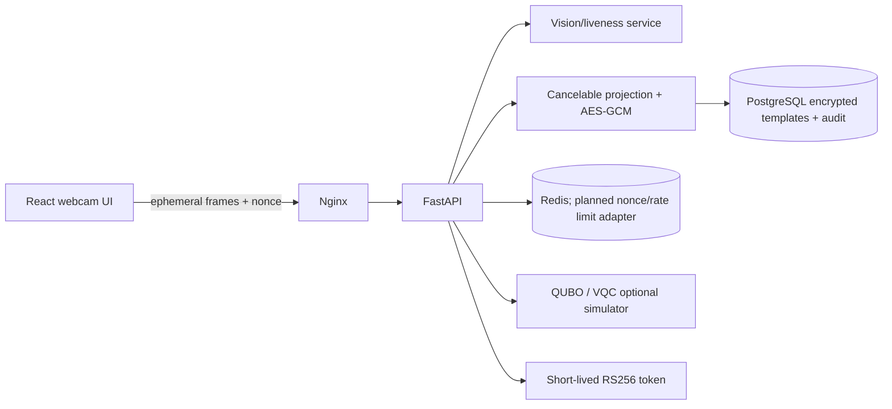

# Architecture

```mermaid
flowchart LR
  Browser[React webcam UI] -->|ephemeral frames + nonce| Proxy[Nginx]
  Proxy --> API[FastAPI]
  API --> Vision[Vision/liveness service]
  API --> Protect[Cancelable projection + AES-GCM]
  Protect --> DB[(PostgreSQL encrypted templates + audit)]
  API --> Cache[(Redis; planned nonce/rate limit adapter)]
  API --> Quantum[QUBO / VQC optional simulator]
  API --> JWT[Short-lived RS256 token]
```

The current API accepts base64 frame payloads but deliberately does not persist them. Deployments should terminate TLS at the proxy and set restrictive CORS origins.
